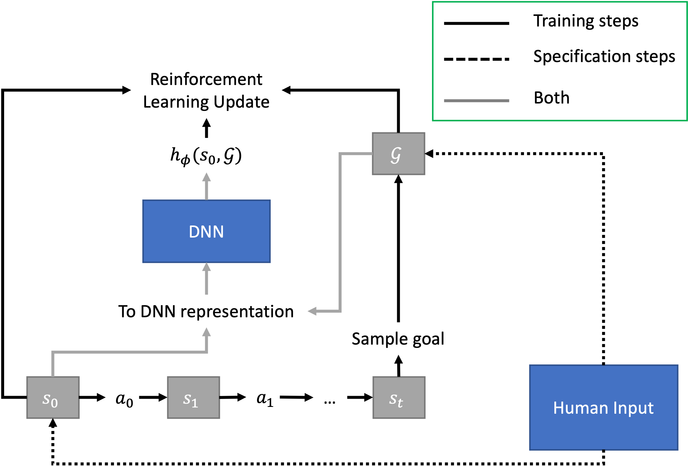

#  DeepXube 

--------------------------------------------------------------------------------

DeepXube (pronounced "Deep Cube") aims to solve classical planning problems in an explainable manner using deep reinforcement learning, 
heuristic search, and formal logic. The current project can:

1) Train a heuristic function to estimate the cost-to-go between state/goal pairs, 
where a goal represents a set of states considered goal states. The representation of the goal can come 
in any form: i.e. a state, a set of ground atoms in first-order logic, natural language, an image/sketch, etc.
2) Specify goals with answer set programming, a robust form of logic programming, in the case where goals are represented as a set of ground atoms in first-order logic.

DeepXube is a generalization of DeepCubeA ([code](https://github.com/forestagostinelli/DeepCubeA/),[paper](https://cse.sc.edu/~foresta/assets/files/SolvingTheRubiksCubeWithDeepReinforcementLearningAndSearch_Final.pdf)).

# Installation

`pip install deepxube`

See [INSTALL.md](INSTALL.md) for more details

# Training a Heuristic Function
To train the heuristic function, state/goal pairs are generated by starting from a given start state and taking random actions to generate a goal state. A goal is then sampled from this goal state.

# Environment

### Implementation

### Testing