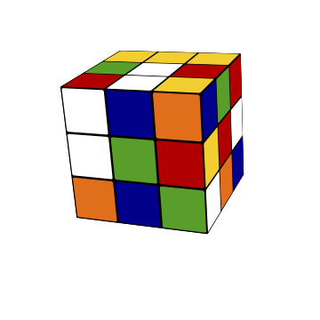
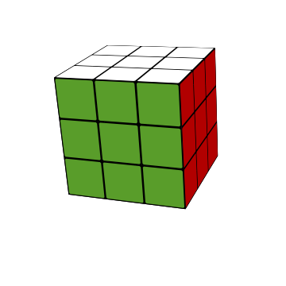
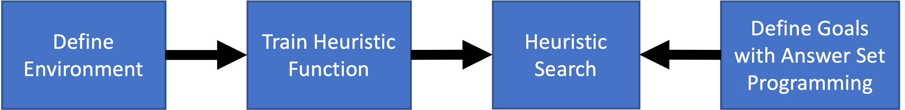

#  DeepXube 

--------------------------------------------------------------------------------

DeepXube (pronounced "Deep Cube") aims to solve classical planning problems in an explainable manner using deep reinforcement learning, 
heuristic search, and formal logic. The current project can:

1) Train a heuristic function to estimate the cost-to-go between state/goal pairs, 
where a goal represents a set of states considered goal states. The representation of the goal can come 
in any form: i.e. a state, a set of ground atoms in first-order logic, natural language, an image/sketch, etc.
2) Specify goals with answer set programming, a robust form of logic programming, in the case where goals are represented as a set of ground atoms in first-order logic.

DeepXube is a generalization of DeepCubeA ([code](https://github.com/forestagostinelli/DeepCubeA/),[paper](https://cse.sc.edu/~foresta/assets/files/SolvingTheRubiksCubeWithDeepReinforcementLearningAndSearch_Final.pdf)).

For any issues, you can create a GitHub issue or contact Forest Agostinelli (foresta@cse.sc.edu).

**Overview**:\

**Outline**:

- [Installation](#installation)
- [Environment](#environment-implementation)
- [Training Heuristic Function](#training-heuristic-function)
- [Heuristic Search](#heuristic-search)
- [Answer Set Programming Specification](#specifying-goals-with-answer-set-programming)
- [Examples](#examples)

## Installation

`pip install deepxube`

See [INSTALL.md](INSTALL.md) for more details

## Environment
The environment includes a state object that defines states, a goal object that defines goals (a set of states considered goal states),
and an environment object that generate start states, define state transitions, when a state a goal state, and the neural network that takes states as an input.

See [ENVIRONMENT.md](ENVIRONMENT.md) for more details

## Training Heuristic Function
Once an environment has been implemented, a heuristic function can be trained to map states and goals to heuristic 
values (estimates of the cost-to-go from a given start state to a given goal).

See [TRAIN.md](TRAIN.md) for more details.

## Heuristic Search
Given a trained heuristic function, a start state, and a goal, heuristic search is used to find a path from the start state 
to the goal.

See [HEURSEARCH.md](HEURSEARCH.md) for more details.

## Specifying Goals with Answer Set Programming
Coming soon.

## Examples
