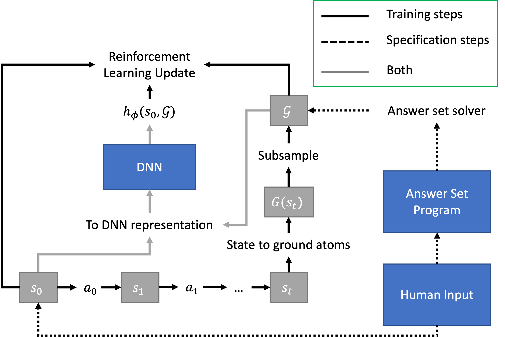

# Training

- [Training with Base Environment](#training-with-base-environment)
- [Training with ASP Environment](#training-with-asp-environment)
- [Deep Approximate Value Iteration](#approximate-value-iteration)
- [Examples](#examples)


## Training with Base Environment
To train the heuristic function, state/goal pairs are generated by starting from a given start state and taking 
random actions to generate a goal state. A goal is then sampled from this goal state.


## Training with ASP Environment



## Deep Approximate value iteration
Given an environment, deep approximate value iteration (DAVI) trains a heuristic function to estimate the cost-to-go 
from a given state to a given goal. For more details see our [DeepCubeA paper](https://cse.sc.edu/~foresta/assets/files/SolvingTheRubiksCubeWithDeepReinforcementLearningAndSearch_Final.pdf).

## Examples
**Training a heuristic function for an environment:**
```
from deepxube.environments.environment_abstract import Environment
from deepxube.training import avi

env: Environment = <construct_your_environment>
avi.train(env, 30, "<directory_to_save_model>", batch_size=10000, itrs_per_update=5000, max_itrs=2000000, 
          greedy_update_step_max=30, num_update_procs=48)
```
