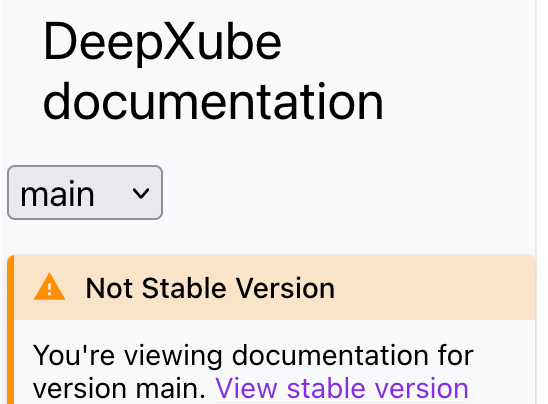

# Installation

## Install with pip
`pip install deepxube`

## Install with pip editable
- Ensure you are not currently in a conda environment by running `conda deactivate`
until there is no parentheses at the beginning of the command line
- Clone the GitHub repository: `git clone git@github.com:forestagostinelli/deepxube.git`
- Update conda, if needed: `conda update -n base -c defaults conda`
- Create conda environment: `conda create --name <your_env_name_here> python=3.10`
- Activate your conda environment: `conda activate <your_env_name_here>`
- Do a pip editable install of the deepxube directory cloned from GitHub `pip install -e ./deepxube/`
- Now, anytime a change is pushed to the main branch, you can do a `git pull`
from the deepxube directory and the changes will automatically be 
reflected in your conda environment
- You can now do the tutorial from the main branch. This is what you should 
see on the left hand side if you are on the main branch:
<div style="text-align: center;">

</div>

```{warning}
Make sure the directory from which you do the tutorial is NOT the parent 
directory of the deepxube directory as this will lead to confusion as to which 
directory to examine when importing deepxube modules
```


## Packages
- Deep reinforcement learning: torch>=2.0, numpy
- Visualization: matplotlib, pillow, types-Pillow, imageio, tensorboard
- Logic: clingo
- Data: wget
- Parallel processing: filelock

## Troubleshooting
If installing pytorch (torch>=2.0) is giving you trouble or the installed version of torch is not working with your 
machine, then you can first install torch according to your own requirements (as long as it is >=2.0) and then install 
deepxube.
